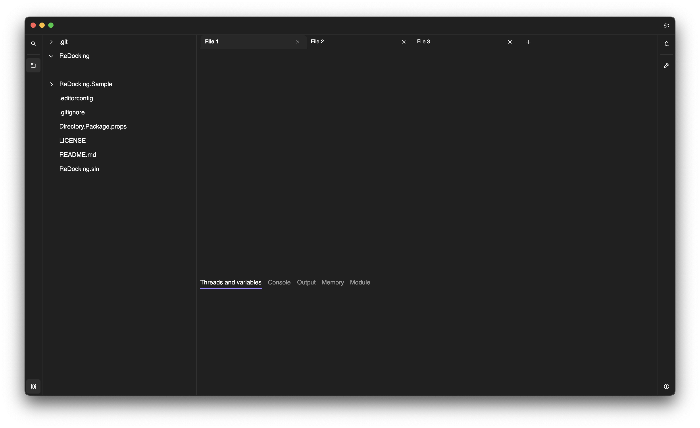

# ReDocking


[](https://www.nuget.org/packages/ReDocking.Avalonia/)

Docking UI library for Avalonia like JetBrains IDEs.



> [!WARNING]
> This library is still in development and not ready for production use.

## Installation

```bash
dotnet add package ReDocking.Avalonia
```

## Usage

See [sample projects](samples).

## License
MIT License
